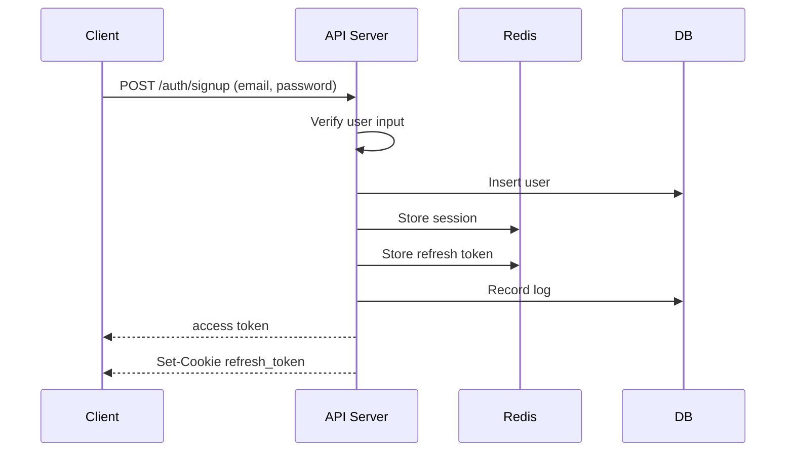
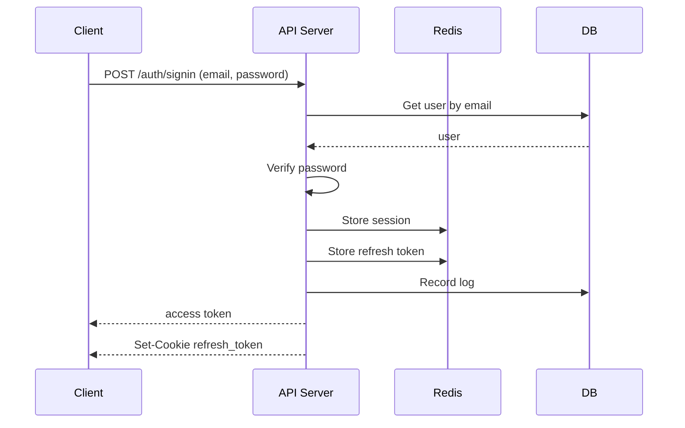
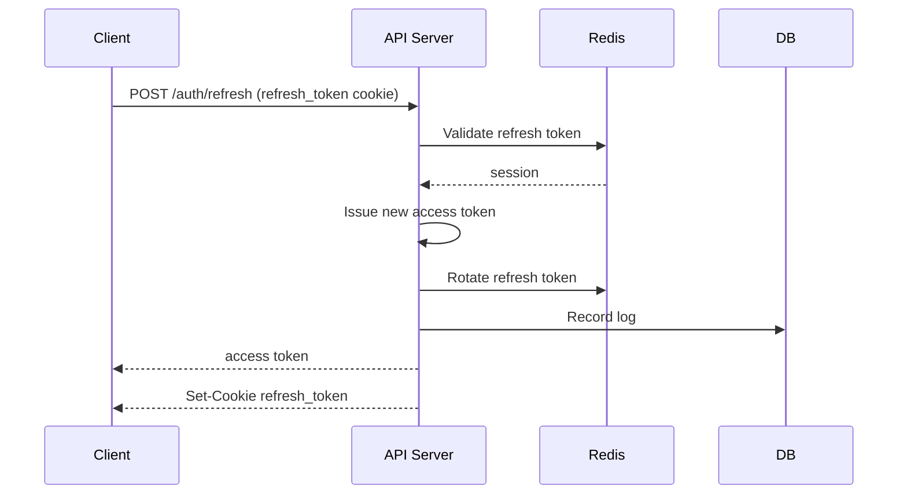
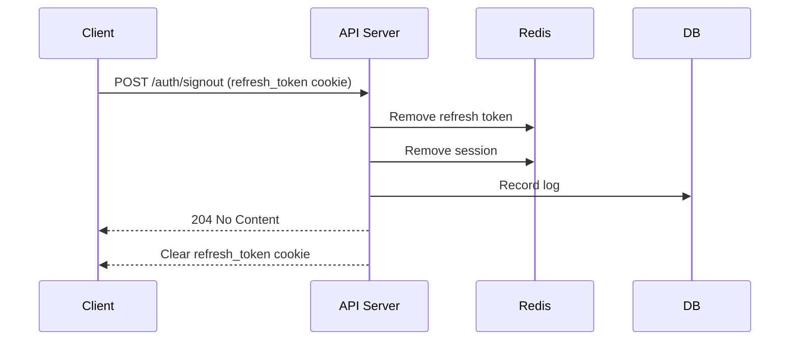

# go-auth-server

JWT access token + rotating refresh token 기반 인증 서버.

---

## 기술 스택

| 분류 | 선택 |
|------|------|
| Language | Go 1.24+ |
| Framework | chi |
| DB | PostgreSQL 15+ |
| Cache | Redis 7+ |

---

## Token 스펙

### Access Token (JWT)

| 항목 | 값 |
|------|----|
| TTL | 10분 (600s) |
| 전달 방식 | `Authorization: Bearer <token>` |
| 알고리즘 | HS256 |

**Claims**

| 필드 | 설명 |
|------|------|
| `sub` | user UUID (외부 식별자, `users._uuid`) |
| `iss` | `"auth-service"` |
| `sid` | session ID (uuid v4) |
| `iat` | 발급 시각 (unix seconds) |
| `exp` | 만료 시각 (unix seconds) |

### Refresh Token (Cookie, opaque)

| 항목 | 값 |
|------|----|
| TTL | 7일 (604800s) |
| Cookie 이름 | `refresh_token` |
| HttpOnly | true |
| Secure | true (local/dev 예외) |
| SameSite | Lax |
| Path | `/auth` |
| Max-Age | 604800s |
| Domain | 미설정 기본(호스트 전용). 멀티 서브도메인 필요 시에만 설정 |

토큰 원문은 서버에 저장하지 않는다. SHA-256 hash만 저장한다.

---

## API

---

### POST `/auth/signup`

**Request**

```json
{
  "email": "{email}",
  "password": "{password}"
}
```

- password 최소 8자

**Response 201**

```json
{
  "code": "SUCCESS",
  "data": {
    "accessToken": "{jwt}",
    "tokenType": "Bearer",
    "expiresIn": 600
  }
}
```

`Set-Cookie: refresh_token=<opaque>; HttpOnly; Secure; SameSite=Lax; Path=/auth; Max-Age=604800`

> 가입 즉시 로그인 상태로 처리한다. signin과 동일한 토큰 발급 흐름을 사용한다.

**Error**

| 상태 | 설명 |
|------|------|
| 400 | 유효성 검사 실패 (email 형식 오류, password 8자 미만 등) |
| 409 | 이미 존재하는 email |

---

### GET `/auth/me`

**Request**

`Authorization: Bearer {accessToken}`

**Response 200**

```json
{
  "code": "SUCCESS",
  "data": {
    "uuid": "{user uuid}",
    "email": "{email}"
  }
}
```

**Error**

| 상태 | 설명 |
|------|------|
| 401 | 토큰 없음 / 만료 / 무효 |

> JWT 서명 및 exp 검증만 수행한다. Redis 세션 조회는 하지 않는다.

---

### POST `/auth/signin`

**Request**
```json
{
  "email": "{email}",
  "password": "{password}"
}
```

**Response `200`**
```json
{
  "code": "SUCCESS",
  "data": {
    "accessToken": "{jwt}",
    "tokenType": "Bearer",
    "expiresIn": 600
  }
}
```
```
Set-Cookie: refresh_token=<opaque>; HttpOnly; Secure; SameSite=Lax; Path=/auth; Max-Age=604800
```

**Error**

| Status | code | 사유 |
|--------|------|------|
| 401 | `INVALID_CREDENTIALS` | 이메일 없음 또는 비밀번호 불일치 |

---

### POST `/auth/refresh`

**Request** — Cookie `refresh_token` 자동 포함

**Response `200`**
```json
{
  "code": "SUCCESS",
  "data": {
    "accessToken": "{jwt}",
    "tokenType": "Bearer",
    "expiresIn": 600
  }
}
```
```
Set-Cookie: refresh_token=<new opaque>; HttpOnly; Secure; SameSite=Lax; Path=/auth; Max-Age=604800
```

**Error**

| Status | code | 사유 |
|--------|------|------|
| 401 | `INVALID_REFRESH_TOKEN` | refresh 없음 / 만료 / 이미 소비됨 → cookie 삭제 |
| 409 | `REFRESH_CONFLICT` | 동시 요청으로 락 획득 실패 |

---

### POST `/auth/signout`

**Request** — Cookie `refresh_token` 자동 포함

**Response `204`** — refresh가 이미 없어도 204 반환
```
Set-Cookie: refresh_token=; Max-Age=0; Path=/auth; Secure; SameSite=Lax
```

---

## 인증 플로우

### Signup



### Signin



### Refresh



### Signout



---

## 데이터베이스

### users

| 컬럼 | 타입 | 설명 |
|------|------|------|
| `_id` | `bigserial PRIMARY KEY` | 내부 식별자 |
| `_uuid` | `uuid NOT NULL DEFAULT gen_random_uuid()` | 외부 식별자. JWT `sub`에 사용 |
| `_cts` | `timestamptz NOT NULL DEFAULT now()` | |
| `_mts` | `timestamptz NOT NULL DEFAULT now()` | 필드 수정 시 해당 시간으로 수정됨 |
| `email` | `varchar(128) NOT NULL UNIQUE` | |
| `password_hash` | `varchar(255) NOT NULL` | argon2id hash |

**인덱스**

| 대상 | 종류 | 비고 |
|------|------|------|
| `_uuid` | UNIQUE | 외부 식별자. 토큰 검증 시 조회 기준 |
| `email` | UNIQUE | 로그인 조회 기준 |

### auth_events

로그성 테이블. PK 없음. 파티셔닝은 트래픽 증가 시 검토.

| 컬럼 | 타입 | 설명 |
|------|------|------|
| `_id` | `bigserial PRIMARY KEY` | 내부 식별자 |
| `_uuid` | `uuid NOT NULL DEFAULT gen_random_uuid()` | 외부 식별자 |
| `_cts` | `timestamptz NOT NULL DEFAULT now()` | |
| `_mts` | `timestamptz NOT NULL DEFAULT now()` | 필드 수정 시 해당 시간으로 수정됨 |
| `event_type` | `varchar(16) NOT NULL` | 코드 레벨 상수로 강제 |
| `user__id` | `bigint` | `users._id` 참조 (FK 미설정, 로그 용도) |
| `session_id` | `varchar(64)` | |
| `ip` | `inet` | |
| `user_agent` | `text` | |

**event_type 값**

`SIGNUP` | `SIGNIN_SUCCESS` | `SIGNIN_FAIL` | `REFRESH_SUCCESS` | `SIGNOUT`

---

## 세션 관리 (Redis)

- 유저당 최대 5개의 동시 세션을 허용 (다중 기기 로그인 지원)
- 5개 초과 시 가장 오래된 세션 자동 제거 (`user_sessions:{userId}` ZSET 기준)

### 데이터 구조

**`sess:{sid}`** — HSET, TTL: 604800s(7D)

| 필드 | 타입 | 설명 |
|------|------|------|
| `userId` | string | |
| `refreshHash` | string | SHA-256 hash |
| `createdAt` | int64 | unix seconds |
| `expiresAt` | int64 | unix seconds |

**`rt:{refreshHash}`** — String, TTL: 604800s(7D)

값: `sid`

**`user_sessions:{userId}`** — ZSET, TTL 없음

| 항목 | 값 |
|------|----|
| member | `sid` |
| score | `created_at` (unix seconds) |

### 세션 5개 초과 시 처리

새 세션 추가 시 `ZRANGE user_sessions:{userId} 0 0`으로 가장 오래된 sid를 조회한다.

- `sess:{sid}`가 존재하면 → `sess`, `rt`, `user_sessions` 항목 삭제
- `sess:{sid}`가 없으면 (이미 만료) → `ZREM`으로 목록에서만 제거

---

## Refresh 회전 & 동시성 처리

refresh token은 1회용이다. 사용 즉시 폐기하고 새 토큰을 발급한다.

rotate 과정 전체를 Lua 스크립트 하나로 실행해 원자성을 보장한다.

**Lua 스크립트 처리 순서**

1. `SET lock:refresh:{oldHash} NX PX 3000` 으로 락 획득
2. 락 실패 → 409 반환 (클라이언트 재시도 권장)
3. `rt:{oldHash}` 조회 → sid 획득
4. `sess:{sid}` 조회 → 세션 데이터 검증
5. 기존 `rt`, `sess` 삭제
6. 새 sid, refresh token, access token 생성
7. 새 `sess`, `rt` 저장 및 `user_sessions` 갱신
8. 락 해제

---

## 보안 정책

### CSRF

Same-origin + SameSite=Lax + OriginGuard 조합으로 대응한다.
동일 오리진 환경(프론트엔드와 API가 같은 도메인)을 전제로 한다.
프론트엔드와 API가 서로 다른 서브도메인 또는 스킴을 사용하는 경우 SameSite 및 CORS 정책을 별도로 검토해야 한다.

### OriginGuard

`/auth/refresh`, `/auth/signout` 에만 적용.

- `Origin` 헤더가 allowlist와 정확히 일치해야 한다
- 없거나 불일치하면 403
- `Vary: Origin` 응답 헤더 포함

### 쿠키 삭제

삭제 시 Set-Cookie 속성은 발급 시와 동일하게 맞춰야 브라우저에서 실제로 삭제된다.
`Path=/auth`, `Secure`, `SameSite=Lax` 를 동일하게 포함하고 `Max-Age=0`으로 설정한다.

---

## 환경변수

| 변수                         | 예시                                                 | 설명                                           |
|----------------------------|----------------------------------------------------|----------------------------------------------|
| `ENV`                      | `local`                                            | `local` / `dev` / `prod`                     |
| `HTTP_PORT`                | `8080`                                             |                                              |
| `HTTP_HOST`                | `0.0.0.0`                                          |                                              |
| `HTTP_HANDLER_TIMEOUT`     | `10s`                                              | 서버에서 요청을 처리하는 시간. 기본값: 10초                   |
| `HTTP_READ_TIMEOUT`        | `5s`                                               | 요청 전체를 읽는 시간. 기본값: 5초                        |
| `HTTP_READ_HEADER_TIMEOUT` | `2s`                                               | 요청 헤더를 읽는 시간. 기본값: 2초                        |
| `HTTP_WRITE_TIMEOUT`       | `10s`                                              | 응답을 클라이언트로 보내는 시간. 기본값: 10초                  |
| `HTTP_IDLE_TIMEOUT`        | `60s`                                              | keep-alive 유휴 연결 유지 시간. 기본값: 60초             |
| `LOG_LEVEL`                | `INFO`                                             | `TRACE` / `DEBUG` / `INFO` / `WARN` / `ERROR` |
| `ACCESS_TOKEN_TTL`         | `10m`                                              | 기본값: 10분                                     |
| `REFRESH_TOKEN_TTL`        | `168h`                                             | 기본값: 7일                                      |
| `JWT_SECRET`               | `secret`                                           |                                              |
| `JWT_ISSUER`               | `auth-service`                                     |                                              |
| `COOKIE_SECURE`            | `true`                                             | cookie에 secure 넣을지 여부. 로컬에서는 false로 고정됨      |
| `CORS_ALLOWED_ORIGINS`     | `http://example.com:8080,https://example.com:8080` | `,`로 구분 가능                                   |
| `USER_SESSION_LIMIT`       | `5`                                                | 유저가 가질 수 있는 세션 개수. 기본값: 5                    |
| `REFRESH_LOCK_TTL`         | `3s`                                               | 리프레시 토큰 만들 때의 lock 유지 시간. 기본값: 3초            |
| `DB_DRIVER`                | `postgres`                                         |                                              |
| `DB_HOST`                  | `localhost`                                        |                                              |
| `DB_PORT`                  | `5432`                                             |                                              |
| `DB_NAME`                  | `my_auth`                                          | 데이터베이스 이름                                    |
| `DB_USER`                  | `my_auth_user`                                     |                                              |
| `DB_PASSWORD`              | `my_auth_password`                                 |                                              |
| `DB_SSLMODE`               | `disable`                                          |                                              |
| `DB_MAX_IDLE_CONNS`        | `1`                                                |                                              |
| `DB_MAX_OPEN_CONNS`        | `10`                                               |                                              |
| `DB_MAX_LIFETIME`          | `30m`                                              |                                              |
| `CACHE_DRIVER`              | `redis`                                            |                                              |
| `CACHE_HOST`               | `localhost`                                        |                                              |
| `CACHE_PORT`               | `6379`                                             |                                              |
| `CACHE_PASSWORD`           | `password`                                         |                                              |
| `CACHE_DB`                 | `0`                                                |                                              |
| `CACHE_POOL_SIZE`          | `20`                                               |                                              |
| `CACHE_KEY_PREFIX`         | `auth:`                                            |                                              |

로컬 실행 시 `.env.example`을 복사해 `.env`로 사용한다.

```bash
cp .env.example .env
```

---

## 로컬 실행

**요구사항**

- Go 1.24+
- PostgreSQL 15+
- Redis 7+

**실행**

```bash
go run ./cmd/auth-server
```
